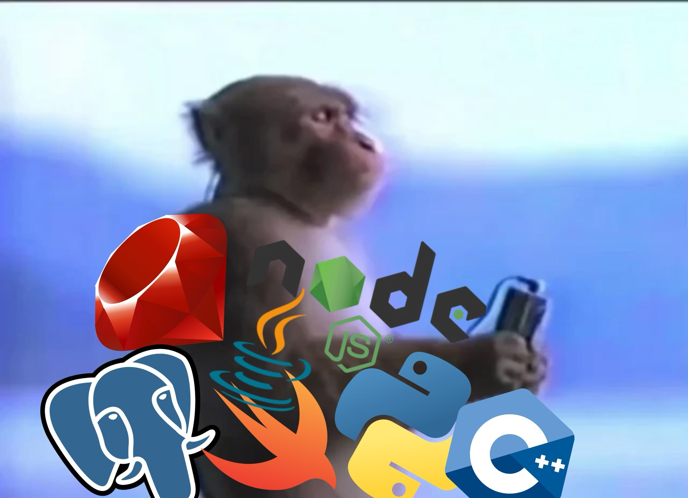

# Comprehensive Programming Learning Roadmap
You will be completely comfortable using any of these languages after this roadmap

## 1. JavaScript (Node.js) – 5-7 months

### Month 1-2: JavaScript Fundamentals
- **Week 1-3**: Core JavaScript concepts
  - **Topics**: Variables, data types, operators, control structures, functions, scope, and hoisting.
  - **Resources**:
    - [MDN JavaScript Guide](https://developer.mozilla.org/en-US/docs/Web/JavaScript/Guide/Introduction)
    - Book: "Eloquent JavaScript" by Marijn Haverbeke (free online)
    - Course: [The Modern JavaScript Tutorial](https://javascript.info/)
  - **Practice**: [HackerRank JavaScript](https://www.hackerrank.com/domains/tutorials/10-days-of-javascript)

- **Week 4-8**: Advanced JavaScript
  - **Topics**: Closures, prototypal inheritance, async programming with Promises and async/await, event loop, and error handling.
  - **Resources**:
    - Course: [JavaScript: Understanding the Weird Parts](https://www.udemy.com/course/understand-javascript/)
    - Book: "You Don't Know JS" series by Kyle Simpson
    - Practice: [Exercism JavaScript track](https://exercism.org/tracks/javascript)

**Reflection**
```
My thoughts this week:
- What I learned:
- What challenged me:
- How I feel about my progress:
- Language Section Review:
- What to focus on next:
```

### Month 3-5: Node.js
- **Week 1-4**: Node.js basics
  - **Topics**: Event-driven architecture, non-blocking I/O, Node.js event loop, and building simple CLI tools.
  - **Resources**:
    - [Node.js official documentation](https://nodejs.org/en/docs/)
    - Course: [Learn Node.js](https://nodejs.dev/learn)
    - Book: "Node.js Design Patterns" by Mario Casciaro
  - **Practice**: Build a simple command-line tool using Node.js.

- **Week 5-8**: Building APIs with Express.js
  - **Topics**: Middleware, routing, error handling, authentication, and building RESTful APIs.
  - **Resources**:
    - Tutorial: [Express.js Guide](https://expressjs.com/en/guide/routing.html)
    - Course: [The Complete Node.js Developer Course](https://www.udemy.com/course/the-complete-nodejs-developer-course-2/)
  - **Practice**: Build a RESTful API with user authentication and CRUD operations.

**Reflection**
```
My thoughts this week:
- What I learned:
- What challenged me:
- How I feel about my progress:
- Language Section Review:
- What to focus on next:
```

### Month 6-7: Real-world projects
- **Week 1-4**: Full-stack application
  - **Topics**: Front-end frameworks (React, Vue.js), state management, and CSS frameworks.
  - **Resources**:
    - [React Documentation](https://reactjs.org/docs/getting-started.html)
    - [Vue.js Guide](https://vuejs.org/v2/guide/)
  - **Practice**: Build a full-stack application with a modern front-end framework.

- **Week 5-8**: Testing and deployment
  - **Topics**: Continuous Integration/Continuous Deployment (CI/CD), containerization with Docker, and deployment strategies.
  - **Resources**:
    - [Docker Documentation](https://docs.docker.com/get-started/)
    - [CI/CD with GitHub Actions](https://docs.github.com/en/actions)
  - **Practice**: Set up CI/CD pipelines for your projects and deploy using Docker.

**Reflection**
```
My thoughts this week:
- What I learned:
- What challenged me:
- How I feel about my progress:
- Language Section Review:
- What to focus on next:
```

## 2. PostgreSQL – 3-5 months

### Month 1: SQL Basics
- **Week 1-2**: Introduction to databases
  - **Topics**: Database normalization, ACID properties, transaction management, and basic SQL queries.
  - **Resources**:
    - [SQL Tutorial](https://www.w3schools.com/sql/)
    - Course: [SQL for Beginners](https://www.postgresqltutorial.com/)
  - **Practice**: [LeetCode SQL Problems](https://leetcode.com/problemset/database/)

- **Week 3-4**: PostgreSQL installation and setup
  - **Topics**: PostgreSQL configuration, backup and restore, and basic administration tasks.
  - **Resources**:
    - [PostgreSQL Documentation](https://www.postgresql.org/docs/)
    - Practice: [PostgreSQL Exercises](https://pgexercises.com/)
  - **Practice**: Set up a PostgreSQL server and configure it for optimal performance.

**Reflection**
```
My thoughts this week:
- What I learned:
- What challenged me:
- How I feel about my progress:
- Language Section Review:
- What to focus on next:
```

### Month 2-3: Intermediate PostgreSQL
- **Week 1-4**: Complex queries and optimization
  - **Topics**: Window functions, common table expressions (CTEs), query performance analysis, and indexing strategies.
  - **Resources**:
    - [PostgreSQL EXPLAIN](https://www.postgresql.org/docs/current/using-explain.html)
    - Book: "The Art of PostgreSQL" by Dimitri Fontaine
  - **Practice**: Optimize complex queries using EXPLAIN and indexing.

- **Week 5-8**: Database design and normalization
  - **Topics**: ER diagrams, denormalization, database sharding, and advanced normalization techniques.
  - **Resources**:
    - [Database Design Tutorial](https://www.lucidchart.com/pages/database-diagram/database-design)
    - Practice: Design a complex database schema for a large-scale application.

**Reflection**
```
My thoughts this week:
- What I learned:
- What challenged me:
- How I feel about my progress:
- Language Section Review:
- What to focus on next:
```

### Month 4-5: Advanced PostgreSQL
- **Week 1-4**: Performance tuning and administration
  - **Topics**: Query caching, connection pooling, high availability setups, and disaster recovery.
  - **Resources**:
    - [PostgreSQL High Availability](https://www.postgresql.org/docs/current/high-availability.html)
    - [Pgpool-II Documentation](https://www.pgpool.net/docs/latest/en/html/)
  - **Practice**: Set up a high-availability PostgreSQL cluster.

- **Week 5-8**: Integration with programming languages
  - **Topics**: ORM integration (e.g., Sequelize, TypeORM), advanced querying techniques, and performance optimization.
  - **Resources**:
    - [Sequelize Documentation](https://sequelize.org/docs/v6/)
    - [TypeORM Documentation](https://typeorm.io/)
  - **Practice**: Integrate PostgreSQL with a Node.js application using an ORM.

**Reflection**
```
My thoughts this week:
- What I learned:
- What challenged me:
- How I feel about my progress:
- Language Section Review:
- What to focus on next:
```

## 3. Ruby – 3-5 months

### Month 1: Ruby Basics
- **Week 1-4**: Ruby syntax and concepts
  - **Topics**: Ruby enumerables, blocks, procs, lambdas, and metaprogramming basics.
  - **Resources**:
    - [Ruby in 20 Minutes](https://www.ruby-lang.org/en/documentation/quickstart/)
    - Book: "The Well-Grounded Rubyist" by David A. Black
    - Course: [Ruby Monk](https://rubymonk.com/)
  - **Practice**: [Codewars Ruby Challenges](https://www.codewars.com/?language=ruby)

**Reflection**
```
My thoughts this week:
- What I learned:
- What challenged me:
- How I feel about my progress:
- Language Section Review:
- What to focus on next:
```

### Month 2-3: Ruby on Rails
- **Week 1-4**: Rails basics
  - **Topics**: Rails generators, migrations, associations, and building CRUD applications.
  - **Resources**:
    - [Ruby on Rails Guides](https://guides.rubyonrails.org/)
    - Tutorial: [Rails Tutorial](https://www.railstutorial.org/book) by Michael Hartl
  - **Practice**: Build a CRUD application with Rails.

- **Week 5-8**: Intermediate Rails
  - **Topics**: Rails engines, concerns, service objects, and testing with RSpec.
  - **Resources**:
    - [Rails Engines Guide](https://guides.rubyonrails.org/engines.html)
    - [Service Objects in Rails](https://blog.appsignal.com/2020/06/09/service-objects-in-ruby-on-rails.html)
  - **Practice**: Refactor a Rails application using service objects and concerns.

**Reflection**
```
My thoughts this week:
- What I learned:
- What challenged me:
- How I feel about my progress:
- Language Section Review:
- What to focus on next:
```

### Month 4-5: Advanced Ruby and Rails
- **Week 1-4**: Advanced Rails features
  - **Topics**: Action Cable, Active Storage, API-only applications, and microservices architecture.
  - **Resources**:
    - [Rails Guides - Action Cable](https://guides.rubyonrails.org/action_cable_overview.html)
    - [Rails Guides - Active Storage](https://guides.rubyonrails.org/active_storage_overview.html)
  - **Practice**: Build a real-time chat application with Action Cable.

- **Week 5-8**: Ruby gems and metaprogramming
  - **Topics**: Building custom gems, Ruby metaprogramming techniques, and contributing to open-source.
  - **Resources**:
    - [RubyGems Guides](https://guides.rubygems.org/)
    - Book: "Metaprogramming Ruby" by Paolo Perrotta
  - **Practice**: Create and publish a custom Ruby gem.

**Reflection**
```
My thoughts this week:
- What I learned:
- What challenged me:
- How I feel about my progress:
- Language Section Review:
- What to focus on next:
```

## 4. Java – 6-9 months

### Month 1-2: Java Fundamentals
- **Week 1-4**: Java syntax and OOP concepts
  - **Topics**: Java collections framework, streams, lambda expressions, and functional interfaces.
  - **Resources**:
    - [Oracle Java Tutorials](https://docs.oracle.com/javase/tutorial/)
    - Book: "Head First Java" by Kathy Sierra and Bert Bates
  - **Practice**: [HackerRank Java](https://www.hackerrank.com/domains/tutorials/10-days-of-java)

- **Week 5-8**: Java Standard Library
  - **Topics**: Multi-threading, concurrency, file handling, and serialization.
  - **Resources**:
    - [Baeldung Java tutorials](https://www.baeldung.com/)
    - Practice: [Coding Bat Java](https://codingbat.com/java)
  - **Practice**: Build a file management system in Java.

**Reflection**
```
My thoughts this week:
- What I learned:
- What challenged me:
- How I feel about my progress:
- Language Section Review:
- What to focus on next:
```

### Month 3-5: Java Enterprise
- **Week 1-6**: Spring Framework
  - **Topics**: Spring Boot, Spring Data JPA, Spring Security, and building RESTful APIs.
  - **Resources**:
    - [Spring Framework Documentation](https://spring.io/guides)
    - Course: [Spring & Hibernate for Beginners](https://www.udemy.com/course/spring-hibernate-tutorial/)
  - **Practice**: Build a secure RESTful API with Spring Boot and Spring Security.

- **Week 7-12**: Java EE (Jakarta EE)
  - **Topics**: Enterprise JavaBeans (EJB), JavaServer Faces (JSF), Java Message Service (JMS), and microservices architecture.
  - **Resources**:
    - [Jakarta EE Tutorial](https://jakarta.ee/learn/)
    - Book: "Beginning Jakarta EE" by Peter Späth
  - **Practice**: Develop a web application with JSF and EJB.

**Reflection**
```
My thoughts this week:
- What I learned:
- What challenged me:
- How I feel about my progress:
- Language Section Review:
- What to focus on next:
```

### Month 6-9: Advanced Java
- **Week 1-6**: Design patterns and architecture
  - **Topics**: Microservices architecture, reactive programming, event-driven architecture, and design patterns.
  - **Resources**:
    - Book: "Effective Java" by Joshua Bloch
    - [Java Design Patterns](https://www.journaldev.com/1827/java-design-patterns-example-tutorial)
  - **Practice**: Refactor an existing application using design patterns.

- **Week 7-12**: Testing and performance optimization
  - **Topics**: JUnit, Mockito, performance profiling, and optimization techniques.
  - **Resources**:
    - [Mockito Documentation](https://site.mockito.org/)
    - [JUnit 5 User Guide](https://junit.org/junit5/docs/current/user-guide/)
  - **Practice**: Write comprehensive unit tests for a Java application.

**Reflection**
```
My thoughts this week:
- What I learned:
- What challenged me:
- How I feel about my progress:
- Language Section Review:
- What to focus on next:
```

## 5. C++ – 6-9 months

### Month 1-2: C++ Basics
- **Week 1-8**: C++ syntax and concepts
  - **Topics**: C++ memory management, pointers, references, and basic data structures.
  - **Resources**:
    - [C++ Reference](https://en.cppreference.com/w/)
    - Book: "C++ Primer" by Stanley Lippman
  - **Practice**: [LeetCode C++ Problems](https://leetcode.com/problemset/all/?difficulty=Easy&topicSlugs=cpp)

**Reflection**
```
My thoughts this week:
- What I learned:
- What challenged me:
- How I feel about my progress:
- Language Section Review:
- What to focus on next:
```

### Month 3-5: Intermediate C++
- **Week 1-6**: Standard Template Library (STL)
  - **Topics**: STL algorithms, iterators, custom allocators, and competitive programming.
  - **Resources**:
    - [C++ STL Tutorial](https://www.geeksforgeeks.org/the-c-standard-template-library-stl/)
    - Book: "Effective STL" by Scott Meyers
  - **Practice**: Implement custom STL algorithms.

- **Week 7-12**: Object-oriented programming in C++
  - **Topics**: Inheritance, polymorphism, encapsulation, and design patterns in C++.
  - **Resources**:
    - [C++ OOP Concepts](https://www.tutorialspoint.com/cplusplus/cpp_object_oriented.htm)
    - [C++ Design Patterns](https://refactoring.guru/design-patterns/catalog)
  - **Practice**: Build a complex OOP project in C++.

**Reflection**
```
My thoughts this week:
- What I learned:
- What challenged me:
- How I feel about my progress:
- Language Section Review:
- What to focus on next:
```

### Month 6-9: Advanced C++
- **Week 1-6**: Memory management and optimization
  - **Topics**: Smart pointers, move semantics, custom memory allocators, and memory profiling.
  - **Resources**:
    - [C++ Core Guidelines](https://isocpp.github.io/CppCoreGuidelines/CppCoreGuidelines)
    - Book: "Effective Modern C++" by Scott Meyers
  - **Practice**: Optimize memory usage in a C++ application.

- **Week 7-12**: Concurrency and modern C++ features
  - **Topics**: Threading, async programming, C++17/20 features, and concurrency models.
  - **Resources**:
    - [C++ Concurrency in Action](https://www.manning.com/books/c-plus-plus-concurrency-in-action)
    - [C++20 Features](https://en.cppreference.com/w/cpp/20)
  - **Practice**: Build a multi-threaded application using C++20 features.

**Reflection**
```
My thoughts this week:
- What I learned:
- What challenged me:
- How I feel about my progress:
- Language Section Review:
- What to focus on next:
```

## 6. Swift – 6-9 months

### Month 1-2: Swift Basics
- **Week 1-8**: Swift syntax and concepts
  - **Topics**: Swift optionals, error handling, protocol-oriented programming, and advanced data structures.
  - **Resources**:
    - [Swift Documentation](https://swift.org/documentation/)
    - Book: "Swift Programming: The Big Nerd Ranch Guide"
  - **Practice**: [HackerRank Swift](https://www.hackerrank.com/domains/tutorials/10-days-of-swift)

**Reflection**
```
My thoughts this week:
- What I learned:
- What challenged me:
- How I feel about my progress:
- Language Section Review:
- What to focus on next:
```

### Month 3-5: iOS Development
- **Week 1-6**: UIKit and Interface Builder
  - **Topics**: Auto Layout, size classes, adaptive layouts, and building responsive iOS apps.
  - **Resources**:
    - [iOS Developer Documentation](https://developer.apple.com/documentation/)
    - [Auto Layout Guide](https://developer.apple.com/library/archive/documentation/UserExperience/Conceptual/AutolayoutPG/index.html)
  - **Practice**: Build responsive iOS apps.

- **Week 7-12**: SwiftUI and Combine
  - **Topics**: SwiftUI animations, custom views, and the Combine framework for reactive programming.
  - **Resources**:
    - [SwiftUI Tutorials](https://developer.apple.com/tutorials/swiftui/)
    - Book: "SwiftUI by Example" by Paul Hudson
  - **Practice**: Build complex UI components with SwiftUI and Combine.

**Reflection**
```
My thoughts this week:
- What I learned:
- What challenged me:
- How I feel about my progress:
- Language Section Review:
- What to focus on next:
```

### Month 6-9: Advanced Swift and iOS
- **Week 1-6**: Networking, persistence, and animations
  - **Topics**: URLSession, Core Data, Core Animation, and advanced networking techniques.
  - **Resources**:
    - [URLSession Documentation](https://developer.apple.com/documentation/foundation/urlsession)
    - [Core Data Tutorial](https://www.raywenderlich.com/7569-getting-started-with-core-data-tutorial)
  - **Practice**: Build a data-driven iOS app with networking and persistence.

- **Week 7-12**: Advanced iOS topics
  - **Topics**: Push notifications, ARKit, Core ML, and integrating advanced iOS features into an app.
  - **Resources**:
    - [Apple Developer Videos](https://developer.apple.com/videos/)
    - [ARKit Documentation](https://developer.apple.com/documentation/arkit)
  - **Practice**: Integrate advanced iOS features into an app.

**Reflection**
```
My thoughts this week:
- What I learned:
- What challenged me:
- How I feel about my progress:
- Language Section Review:
- What to focus on next:
```

## Python (Passive Learning)

### Throughout the year:
- **Week 1-52**: Supplement school learning
  - **Topics**: Python decorators, context managers, advanced data structures, and web development with Django/Flask.
  - **Resources**:
    - [Python Documentation](https://docs.python.org/3/)
    - Book: "Automate the Boring Stuff with Python" by Al Sweigart
    - Practice: [LeetCode Python Problems](https://leetcode.com/problemset/all/?difficulty=Easy&topicSlugs=python)

**Reflection**
```
My thoughts this week:
- What I learned:
- What challenged me:
- How I feel about my progress:
- Language Section Review:
- What to focus on next:
```

## After Completing the Roadmap

After finishing this comprehensive roadmap, continue your learning journey by practicing on LeetCode to master advanced concepts and algorithms. LeetCode provides programming challenges that will help you:

1. Apply your knowledge from all languages you've learned.
2. Strengthen your problem-solving abilities.
3. Prepare for technical interviews.
4. Understand complex algorithms and data structures.
5. Improve code efficiency and optimization techniques.

Focus on solving problems in each language you've learned to reinforce your skills and understand the nuances of implementing solutions across different programming paradigms.

**Time Commitment:** With a study pace of 20-30 hours per month (5-7 hours per week), this entire roadmap will take approximately 3.5 to 4.5 years to complete. The timeline allows for a realistic learning pace while maintaining regular progress and knowledge retention.


**Reflection**
```
My thoughts this week:
- What I learned:
- What challenged me:
- How I feel about my progress:
- Language Section Review:
- What to focus on next:
```
